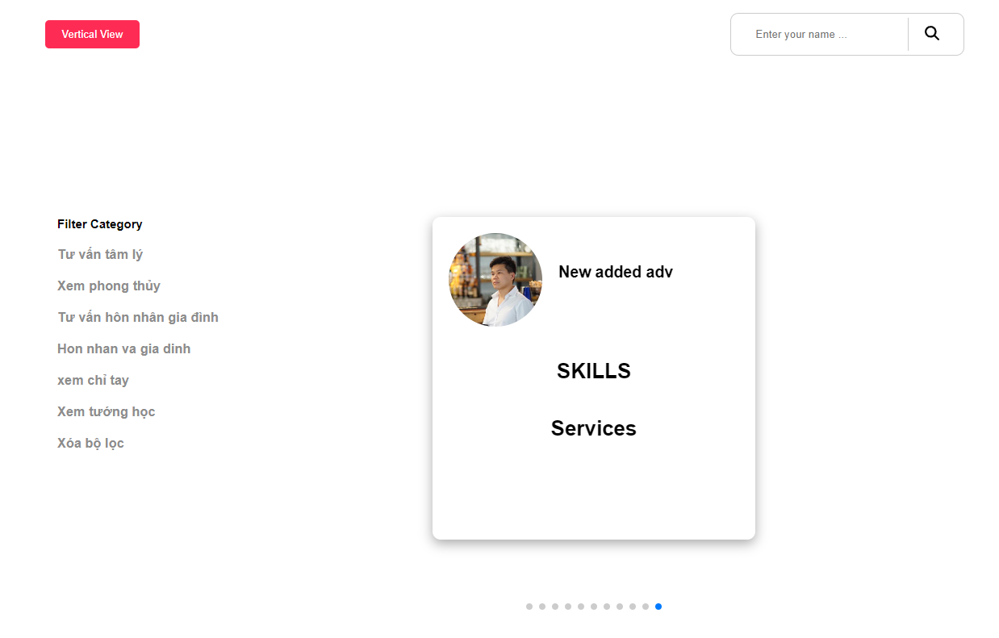

Thank you for giving me the opportunity to take this test.
Here is how to run the project on local

Step 1: Run the folder "fake-api" with teminal

> cd fake-api
> npm install json-server
> json-server --watch db.json --port 3001

step 2: run the folder "list-adv" in terminal

> cd list-adv"
> npm start"

Here is a picture of the product I made

- Use vertical view button to change landscape view and opposite.
- We can enter the name and click on icon it to find the item corresponding to the name and the category below the body is used to filter by type name

Dang Nguyen
